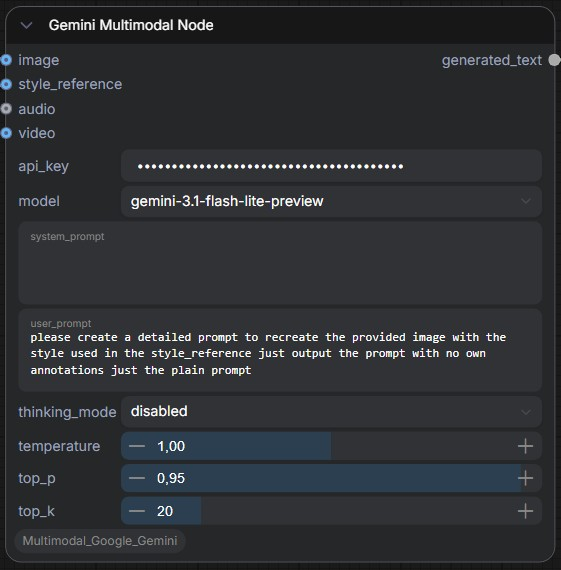

# ComfyUI Gemini Multimodal Node

A natively multimodal ComfyUI custom node that integrates **Google Gemini** models into your workflows. Analyze images, audio, and video — then generate detailed text prompts for downstream diffusion models, all within ComfyUI's node graph.

  



---

## Features

- **Native Multimodality** — Send text, images, audio, and video to Gemini in a single inference call
- **Style Reference Input** — Dedicated secondary image input with in-context learning to guide stylistic prompt generation
- **Thinking Mode Control** — Toggle Gemini's deep reasoning (low / medium / high) for complex analytical tasks
- **API Key Security** — Key is visually masked on the node canvas and in the edit input (rendered as `••••••`)
- **Automatic Retry** — Exponential backoff (via tenacity) handles rate limits (429) and transient API errors gracefully
- **Google Files API** — Audio and video are uploaded through Google's Files API for efficient server-side processing
- **Temp File Cleanup** — All intermediate `.wav` and `.mp4` files are automatically deleted after inference

---

## Supported Models

| Model | Tier | Best For |
|---|---|---|
| `gemini-2.5-flash` | Free | Fast general-purpose inference |
| `gemini-3-flash-preview` | Free | Advanced reasoning with thinking mode |
| `gemini-3.1-flash-lite-preview` | Free | Lightweight, lowest latency |

---

## Installation

### ComfyUI Manager (Recommended)

Search for **"Gemini Multimodal"** in ComfyUI Manager and click Install.

### Manual Installation

1. Navigate to your ComfyUI `custom_nodes/` directory:
   ```bash
   cd ComfyUI/custom_nodes/
   ```

2. Clone the repository:
   ```bash
   git clone https://github.com/YOUR_USERNAME/comfyui-gemini-multimodal.git
   ```

3. Install dependencies:
   ```bash
   cd comfyui-gemini-multimodal
   pip install -r requirements.txt
   ```

4. Restart ComfyUI.

### Portable ComfyUI Installation

If you are using the **portable/standalone version** of ComfyUI, you must install the dependencies using the embedded Python interpreter:

1. Navigate to the `python_embeded` folder inside your ComfyUI installation directory
2. Open a terminal or command prompt from that folder
3. Run the following command:
   ```bash
   python.exe -m pip install -r ComfyUI\custom_nodes\comfyui-gemini-multimodal\requirements.txt
   ```
   > Adjust the path to `requirements.txt` if your folder structure differs.

4. Restart ComfyUI.

### Dependencies

| Package | Purpose | Note |
|---|---|---|
| `google-genai` | Unified Google Gemini SDK | Required |
| `tenacity` | Retry logic with exponential backoff | Required |
| `imageio[ffmpeg]` | Video frame encoding to MP4 | Required |
| `torch`, `numpy`, `Pillow`, `torchaudio` | Tensor & media processing | Already in ComfyUI |

---

## Getting an API Key

1. Go to [Google AI Studio](https://aistudio.google.com/apikey)
2. Click **"Create API Key"**
3. Copy the key and paste it into the node's `api_key` field

The free tier includes generous rate limits for all supported models. No billing setup required.

---

## Node Reference

### Gemini Multimodal Node

Found in the **Add Node** menu under: `Gemini` > `Gemini Multimodal Node`

#### Required Inputs

| Input | Type | Default | Description |
|---|---|---|---|
| `api_key` | STRING | — | Your Google Gemini API key (masked in the UI) |
| `model` | Dropdown | `gemini-2.5-flash` | Gemini model to use |
| `system_prompt` | STRING (multiline) | *Prompt engineer persona* | System instruction defining the model's role |
| `user_prompt` | STRING (multiline) | — | Your specific instruction or question |
| `thinking_mode` | Dropdown | `disabled` | Deep reasoning level: `disabled`, `low`, `medium`, `high` |
| `temperature` | FLOAT | `1.0` | Randomness (0.0 = deterministic, 2.0 = maximum creativity) |
| `top_p` | FLOAT | `0.95` | Nucleus sampling threshold |
| `top_k` | INT | `20` | Limits token selection to top K candidates |

#### Optional Inputs

| Input | Type | Description |
|---|---|---|
| `image` | IMAGE | Primary image for visual analysis (VQA, captioning, description) |
| `style_reference` | IMAGE | Secondary image used as a stylistic anchor — the model adopts its visual style without describing it as the subject |
| `audio` | AUDIO | Audio input (uploaded via Google Files API) |
| `video` | IMAGE | Video as a frame batch from video loader nodes (compressed to MP4, uploaded via Files API) |

#### Output

| Output | Type | Description |
|---|---|---|
| `generated_text` | STRING | The text response from Gemini — typically a detailed image prompt |

---

## Usage Examples

### Text-Only Prompt Generation

Simply connect the `generated_text` output to a CLIP Text Encode node:

```
[Gemini Multimodal Node] → generated_text → [CLIP Text Encode] → conditioning → [KSampler]
```

### Image Analysis + Prompt Rewrite

1. Connect a **Load Image** node to the `image` input
2. Write a user prompt like: *"Describe this image in detail for a Stable Diffusion prompt"*
3. The output is a SD-ready prompt describing the image

### Style Transfer Prompting

1. Connect your **subject image** to `image`
2. Connect your **style reference image** to `style_reference`
3. User prompt: *"Create a detailed prompt to recreate the provided image with the style used in the style_reference, just output the plain prompt"*
4. Gemini analyzes both images and generates a prompt that combines the subject with the reference style

### Video Analysis

1. Use a video loader node (e.g., VHS_LoadVideo) to load a video — this outputs a frame batch
2. Connect the frame batch to the `video` input
3. User prompt: *"Analyze the key visual moments in this video and create a prompt for the most dramatic frame"*

---

## Thinking Mode

Thinking mode enables Gemini's internal chain-of-thought reasoning for complex tasks:

| Level | Latency | Use Case |
|---|---|---|
| `disabled` | Fastest | Simple descriptions, basic prompts |
| `low` | Low | Straightforward analysis with some reasoning |
| `medium` | Medium | Multi-step analysis, comparing styles |
| `high` | Highest | Complex compositional prompts, deep visual reasoning |

> **Note:** Thinking mode is most effective with `gemini-3-flash-preview` and newer models.

---

## API Key Security

The API key is protected by a frontend JavaScript extension:

- **On the canvas**: The key renders as bullet characters (`••••••••`) — the actual value is never visible
- **During editing**: Any spawned input element is automatically converted to a password field
- **In memory**: The real key is preserved and sent correctly to the backend for API authentication

> **Tip:** Never share screenshots of your workflow without verifying the key is masked. If you share `.json` workflow files, the API key **will** be embedded in the file — remove it before sharing.

---

## Error Handling

| Scenario | Behavior |
|---|---|
| Empty API key | Raises `ValueError` with a descriptive message |
| Rate limit (429) | Retries up to 5 times with exponential backoff (2s → 4s → 8s → 16s → 32s) |
| Network timeout | Retries automatically |
| Invalid API key (401) | Error propagates to ComfyUI's error display |
| Bad request (400) | Error propagates with API error details |

Retry attempts are logged at `WARNING` level in ComfyUI's console.

---

## Project Structure

```
comfyui-gemini-multimodal/
├── __init__.py              # Node registration & WEB_DIRECTORY
├── nodes/
│   ├── __init__.py
│   └── gemini_node.py       # GeminiMultimodalNode class
├── utils/
│   ├── __init__.py
│   └── media.py             # Tensor → PIL, audio → WAV, frames → MP4
├── js/
│   └── hide_api_key.js      # Frontend API key masking
├── requirements.txt
├── pyproject.toml
└── README.md
```

---

## Troubleshooting

### Node doesn't appear in ComfyUI

- Ensure the package is inside `ComfyUI/custom_nodes/`
- Check the ComfyUI console for import errors
- Verify dependencies: `pip install -r requirements.txt`

### API key still visible after update

- Hard-refresh the browser (`Ctrl+Shift+R`)
- Clear browser cache
- Restart ComfyUI server

### "429 RESOURCE_EXHAUSTED" errors

This means you've hit Google's rate limit. The node automatically retries with exponential backoff. If it persists:
- Wait a few minutes before retrying
- Use `gemini-3.1-flash-lite-preview` (higher rate limits)
- Reduce batch processing frequency

### Audio/Video not working

- Ensure `torchaudio` is available in your ComfyUI Python environment
- Ensure `imageio[ffmpeg]` is installed: `pip install "imageio[ffmpeg]"`
- Check ComfyUI console for temp file errors

---

## License

MIT

---

## Acknowledgments

- [ComfyUI](https://github.com/comfyanonymous/ComfyUI) — The node-based UI framework
- [Google GenAI SDK](https://github.com/googleapis/python-genai) — The unified Python SDK for Gemini
- [Tenacity](https://github.com/jd/tenacity) — Retry library for Python
